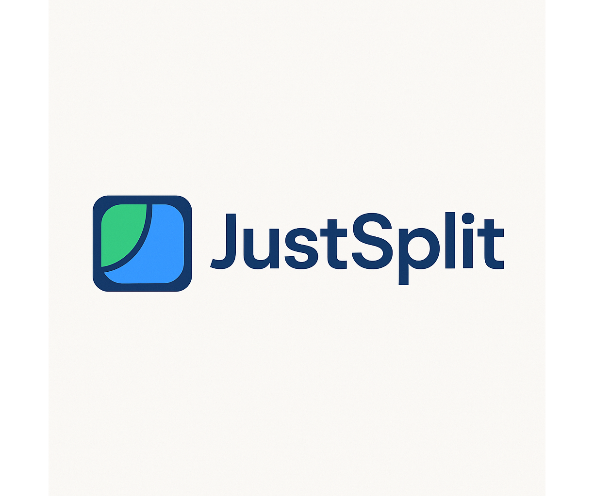

> **Fair expense splitting, made simple.** Track, divide, and settle shared expenses effortlessly — for trips, events, or daily life.

## About JustSplit

JustSplit is an open-source, lightweight platform designed to make managing shared expenses easy, transparent, and fair. Whether you're planning a vacation with friends, organizing a group dinner, or sharing household bills, JustSplit ensures that everyone pays their fair share — without the headaches.

This monorepo architecture supports multiple applications with a central authentication hub, enabling scalable deployment of low-cost applications on Firebase or on-premises.

## 🏗️ NX Monorepo Architecture

This project uses NX for managing multiple applications in a monorepo, optimized for low-cost deployment on Firebase or on-premises hosting.

### Why NX?

- **Build Caching**: Incremental builds with local and remote caching
- **Dependency Graph**: Visualize and understand project dependencies
- **Affected Commands**: Run tasks only on changed projects
- **Code Generation**: Consistent code scaffolding
- **Powerful Tooling**: Built-in support for Next.js, React, and TypeScript

### Project Structure

```
justsplit-monorepo/
├── apps/                    # Applications
│   ├── hub/                # Central authentication hub
│   └── justsplit/          # Expense splitting application
├── libs/                   # Shared libraries (NX convention)
│   ├── shared-types/       # TypeScript type definitions
│   ├── firebase-config/    # Firebase configuration utilities
│   └── ui-components/      # Reusable UI components
├── firebase/               # Firebase deployment configurations
│   ├── hub/               # Hub project config
│   └── justsplit/         # JustSplit project config
├── scripts/               # Deployment scripts
├── nx.json               # NX workspace configuration
└── workspace.json        # Project definitions
```

## Key Features

- **Flexible Splitting Options**: Divide expenses equally, by percentages, by usage, or using custom weights (e.g., time used, quantity consumed).
- **Multi-Currency Support**: Record expenses in any currency, with automatic real-time conversions.
- **Payment Integration**: Easily connect with PayPal, Venmo, and other popular payment platforms (planned).
- **Trip and Event Management**: Group expenses into trips or events, manage budgets, and close events to lock expenses.
- **Real-Time Collaboration**: Instantly see new expenses and payments from group members.
- **Smart Settlements**: Automatically calculate who owes whom, minimizing the number of transactions needed.
- **Partial Payments Support**: Track partial reimbursements over time.
- **Data Privacy First**: End-to-end encryption ensures your financial data stays private.
- **Cross-Platform and Offline-Friendly**: Use JustSplit on any device, even with limited internet connectivity.
- **Open-Source Freedom**: Self-host it anywhere, or deploy free on GitHub Pages in minutes.

## Example Use Case

> 🎒 **Trip to Paris**:  
> - Alice pays $500 for the hotel.  
> - Bob covers $200 for dinners.  
> - Charlie books a $100 tour.  
> 
> JustSplit calculates the balance automatically: Bob and Charlie owe Alice, with minimal payments needed.

## 🚀 Getting Started

### Prerequisites

- Node.js 18+
- npm 9+ or yarn
- Firebase CLI (for deployment)
- NX CLI (recommended)

### Installation

1. Install NX CLI globally (recommended):
```bash
npm install -g nx
```

2. Install dependencies:
```bash
npm install
```

3. Set up environment variables:

For the hub app (`apps/hub/.env.local`):
```
NEXT_PUBLIC_HUB_API_KEY=your-hub-api-key
NEXT_PUBLIC_HUB_AUTH_DOMAIN=your-hub-auth-domain
NEXT_PUBLIC_HUB_PROJECT_ID=your-hub-project-id
NEXT_PUBLIC_HUB_STORAGE_BUCKET=your-hub-storage-bucket
NEXT_PUBLIC_HUB_MESSAGING_SENDER_ID=your-hub-sender-id
NEXT_PUBLIC_HUB_APP_ID=your-hub-app-id
NEXT_PUBLIC_JUSTSPLIT_URL=http://localhost:4000
```

For the JustSplit app (`apps/justsplit/.env.local`):
```
# Hub configuration (for authentication)
NEXT_PUBLIC_HUB_API_KEY=your-hub-api-key
NEXT_PUBLIC_HUB_AUTH_DOMAIN=your-hub-auth-domain
NEXT_PUBLIC_HUB_PROJECT_ID=your-hub-project-id
NEXT_PUBLIC_HUB_STORAGE_BUCKET=your-hub-storage-bucket
NEXT_PUBLIC_HUB_MESSAGING_SENDER_ID=your-hub-sender-id
NEXT_PUBLIC_HUB_APP_ID=your-hub-app-id

# App-specific configuration (optional - will use hub if not provided)
NEXT_PUBLIC_JUSTSPLIT_API_KEY=your-app-api-key
NEXT_PUBLIC_JUSTSPLIT_AUTH_DOMAIN=your-app-auth-domain
NEXT_PUBLIC_JUSTSPLIT_PROJECT_ID=your-app-project-id
NEXT_PUBLIC_JUSTSPLIT_STORAGE_BUCKET=your-app-storage-bucket
NEXT_PUBLIC_JUSTSPLIT_MESSAGING_SENDER_ID=your-app-sender-id
NEXT_PUBLIC_JUSTSPLIT_APP_ID=your-app-app-id
```

## 🛠️ Development

### Running Applications

Run all applications:
```bash
nx run-many --target=serve --all

# Or using npm scripts
npm run dev
```

Run specific applications:
```bash
nx serve hub           # Run the hub at http://localhost:3000
nx serve justsplit-app # Run JustSplit at http://localhost:4000

# Or using npm scripts
npm run dev:hub
npm run dev:justsplit
```

View the dependency graph:
```bash
nx dep-graph
```

### Firebase Emulators

Start Firebase emulators for local development:
```bash
nx run justsplit-app:emulators

# Or manually
cd apps/justsplit
npm run emulators
```

### Testing

Run all tests:
```bash
nx run-many --target=test --all
```

Run tests for a specific app:
```bash
nx test justsplit-app
nx test hub
```

Run only affected tests:
```bash
nx affected:test --base=main
```

For more details on our testing approach and strategies, see our [Local Development Guide](docs/development/local-development.md#testing).

### Building

Build all applications:
```bash
nx run-many --target=build --all --configuration=production
```

Build specific applications:
```bash
nx build hub --configuration=production
nx build justsplit-app --configuration=production
```

Build only affected applications:
```bash
nx affected:build --base=main --configuration=production
```

## 📦 Deployment

### Manual Deployment

Deploy the hub:
```bash
./scripts/deploy-hub.sh
```

Deploy JustSplit:
```bash
./scripts/deploy-justsplit.sh
```

Deploy all applications:
```bash
./scripts/deploy-all.sh
```

### Automatic Deployment

The monorepo includes GitHub Actions workflows that automatically deploy applications when changes are pushed to the main branch.

## 🔐 Authentication Flow

1. User logs in via the Hub application
2. Hub issues a Firebase Auth token
3. User navigates to an app (e.g., JustSplit)
4. App verifies the token with the Hub project
5. App creates/updates local user record linked to hub UID

## 📚 Development Guidelines

### Adding a New Application

1. Create a new directory under `apps/`
2. Initialize a Next.js application
3. Add Firebase configuration for multi-project support
4. Update `pnpm-workspace.yaml` if needed
5. Create deployment configuration in `firebase/`

### Local Development

To set up your local development environment, check out our detailed [Local Development Guide](docs/development/local-development.md).

### Code Style

- Use TypeScript for all new code
- Follow the existing ESLint configuration
- Write tests for new features
- Keep components small and focused

### Commit Messages

Follow conventional commits:
- `feat:` New features
- `fix:` Bug fixes
- `docs:` Documentation changes
- `style:` Code style changes
- `refactor:` Code refactoring
- `test:` Test additions or changes
- `chore:` Build process or auxiliary tool changes

## Details on Features and Roadmap

To get a deep dive on features and our roadmap check the [JustSplit Consolidated Feature Matrix and Detailed Roadmap documentation.](/docs/JustSplit%20Consolidated%20Feature%20Matrix%20and%20Detailed%20Roadmap.markdown)

## Get Involved

JustSplit is community-driven! Contributions, ideas, and feedback are welcome.  
[Learn how to contribute](#) or open an issue to start a discussion.

## 📄 License

This project is licensed under the MIT License.